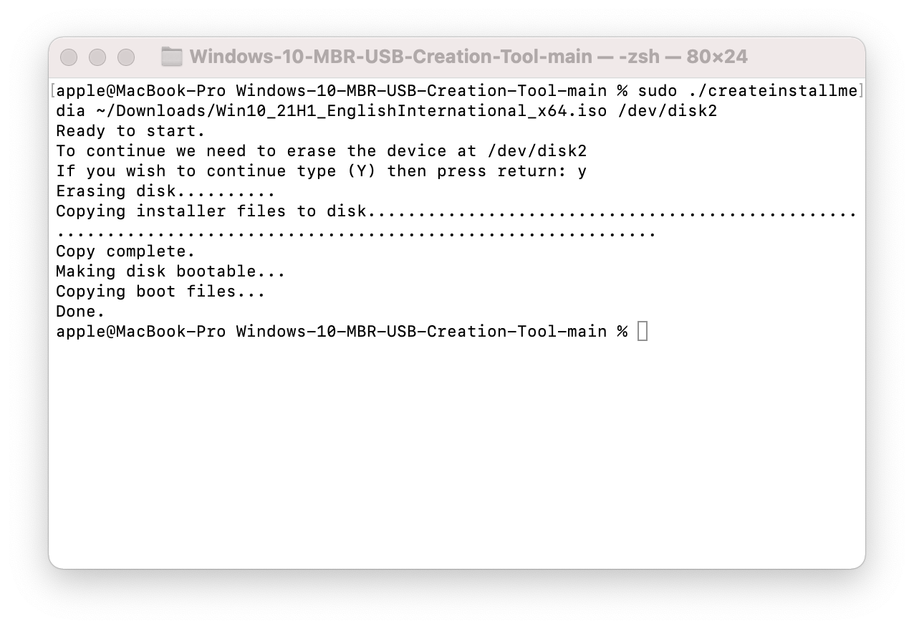

# Windows 10 MBR USB Media Creation Tool

 Usage: ./createinstallmedia /path/to/win10.iso /dev/diskX  
 Must be run as root

 

 This is a tool created to solve a specific need - to create a Windows 10
 installation USB for legacy BIOS systems using MBR, with minimal additional
 tools, on macOS. A couple of interesting things to note:

 - macOS has long included a tool to format NTFS-compatible partitions,
   possibly since macOS Sierra as part of the Boot Camp Assistant program
 - macOS has had the ability to mount NTFS volumes read/write since at least
   Mac OS X Snow Leopard
 - macOS has included fdisk for a long time. The man page is dated 2002!

 The only external utility required is ms-sys, available at http://ms-sys.sourceforge.net  
 A compiled macOS binary is included here for ease of use.

 createinstallemedia mimics Apple's 'createinstallmedia' binary, documented at
 https://support.apple.com/HT201372